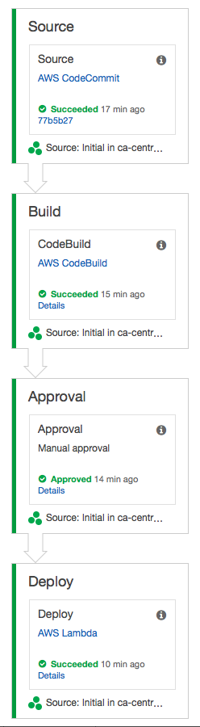
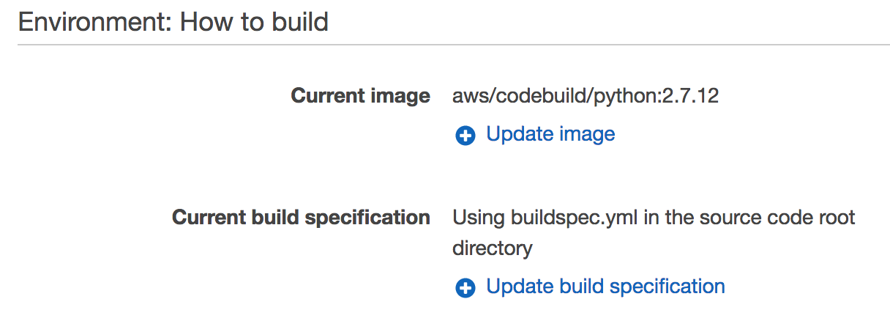
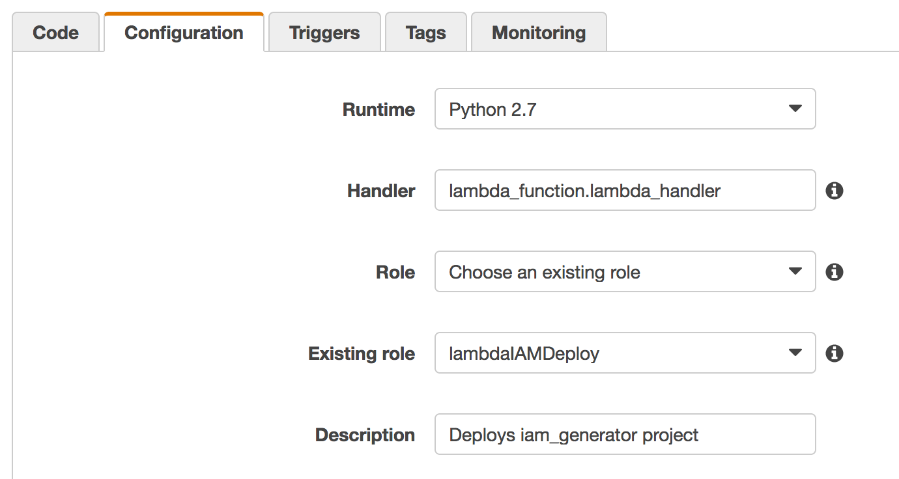
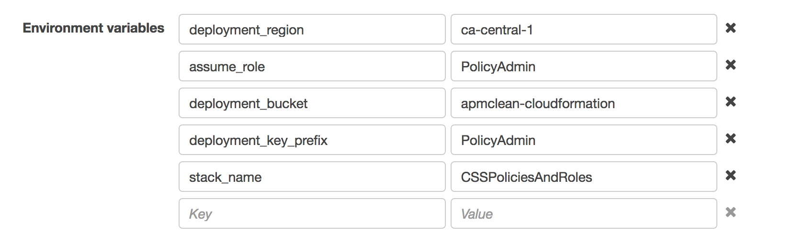

# Using a Pipeline

Once you're comfortable with using the tool by hand, I recommend putting it into a pipeline.  This assures your deployment remains consistent across all AWS accounts.  It also gives an opportunity to review changes with approval step(s) as desired.

I've included the skeletons of a pipeline using the AWS tooling:

* [codepipeline](https://aws.amazon.com/codepipeline/)
* [codebuild](https://aws.amazon.com/codebuild/)


## CodePipeline Overview

The pipeline can be triggered from a commit to a branch either in [GitHub](https://github.com/) or [AWS CodeCommit](https://aws.amazon.com/codecommit/).

The build portion of the pipeline can be accomplished using [AWS CodeBuild](https://aws.amazon.com/codebuild/).  A `buildspec.yaml` is included in the root of this project that CodeBuild can use to build, and pass artifacts along to CodePipeline for consumption downstream.

Finally I've included a deployment Lambda function that will copy the CloudFormation templates to the various accounts.

A sample pipeline might look like this:



## CodeBuild

The `buildspec.yaml` included in the root of the project is tested against CodeBuild.

Use an AWS Provided image that supports Python 2.7.  For the build specification configure it to use the included buildspec.yaml.

For example:



## Deployment Lambda Function

### Functional overview

The deployment Lambda function will:

1. Retrieve the build artifact from the CodePipeline s3 bucket.
2. Copy the built templates to a deployment s3 bucket.
3. Assume a role in all configured accounts.
4. With the assumed role; deploy or update the CloudFormation templates.
5. Wait for the CloudFormation templates to finish, then return success or failure to CodePipeline.

### Lambda Role

The Lambda function will require a role that can assume roles in your child accounts to perform a deployment.  This role must also have create object permissions in the deploy bucket so the Lambda function can copy the built templates.

Assuming that you're using a role called 'PolicyAdmin' in all of your accounts, the Lambda Role should have these permissions:

```json
{
    "Version": "2012-10-17",
    "Statement": [
        {
            "Action": "sts:AssumeRole",
            "Resource": "arn:aws:iam::*:role/PolicyAdmin",
            "Effect": "Allow"
        },
        {
            "Action": [
                "s3:ListBucket"
            ],
            "Resource": [
                "arn:aws:s3:::deploy-bucket"
            ],
            "Effect": "Allow"
        },
        {
            "Action": [
                "s3:PutObject",
                "s3:GetObject",
                "s3:DeleteObject"
            ],
            "Resource": [
                "arn:aws:s3:::deploy-bucket/*"
            ],
            "Effect": "Allow"
        }
    ]
}
```

In addition to the above policy document, include the pre-defined base execution policy for Lambda: `arn:aws:iam::aws:policy/service-role/AWSLambdaBasicExecutionRole` which assures Lambda can write execution logs to CloudWatch Logs.

### Deployment Bucket in s3

The CodePipeline s3 bucket isn't easily shared since it uses a KMS key by default.  This means when the Lambda function assumes a role in the child account to run a CloudFormation template, it will not have permissions to read the artifact from s3.

To mitigate this, the Lambda function will copy to a deployment bucket which has a pre-configured policy to be shared among all child accounts.

The s3 deploy-bucket will need to be readable by all of the accounts the Lambda function will be assuming a role in.  Assuming you have accounts 123456678910, 109876543210, 309876543210, and 309876543210; you will need a bucket policy for deploy-bucket as follows:

```json
{
    "Version": "2012-10-17",
    "Statement": [
        {
            "Effect": "Allow",
            "Principal": {
                "AWS": [ 
                    "123456678910",
                    "109876543210",
                    "309876543210",
                    "309876543210"
                ]
            },
            "Action": [
                "s3:ListBucket",
                "s3:GetObject"
            ],
            "Resource": [
                "arn:aws:s3:::deploy-bucket",
                "arn:aws:s3:::deploy-bucket/*"
            ]
        }
    ]
}
```

This can be made more restrictive as desired. For a writeup on bucket sharing se [here](http://docs.aws.amazon.com/AmazonS3/latest/dev/example-walkthroughs-managing-access-example2.html).

### Lambda Function

Deploy the Lambda function using your favorite technique.  The interpreter is python 2.7.  It will require 128MB of memory, and should have the maximum timeout (5 minutes currently).  Assure it is set to use the role created above.

Eg:


The following Lambda variables should be configured to match your environment:

`deployment_bucket`: Name of the shared s3 bucket.

`deployment_key_prefix`: Name of the prefix to use within the s3 bucket.

`deployment_region`: The region to deploy the templates in (eg: us-east-1, ca-central-1, etc).

`assume_role`: The name of the role to assume in the child accounts for deployment.

`stack_name`: The name of the stack to deploy in the child accounts.

For example:

